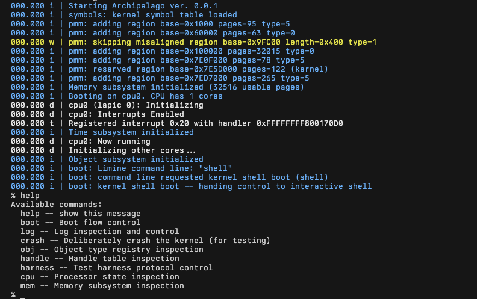

# Archipelago

Archipelago is a minimal, security-focused operating system for x86_64, written in freestanding C++20. It's a blend of a microkernel and exokernel.

It boots via [Limine](https://github.com/limine-bootloader/limine), runs on QEMU, and is developed against a fully automated test harness with fuzzing, thread-sanitizer, and crash-forensics lanes.



## The idea
Archipelago is built around a small set of opinionated design principles, documented in [docs/Design](docs/Design/Design%20Principles.md).

The kernel is taught, it's not UNIX, and we achieve performance through avoidance.

The kernel works by providing typed [kernel objects](docs/Design/Object%20Model.md) that can be accessed via a rights-carrying [handle](docs/Design/Handle%20Table.md). Every task views the system through its handle table. These are types such as [tasks, threads](docs/Design/Task%20Model.md), VMOs, [channels, ports](docs/Design/IPC%20Primitives.md).

Subsystems like filesystems and networking are userspace servers, which register object types with the kernel, and then teach the kernel how to operate on those during runtime. The kernel enforces rights, flips signal bits, manages buffers for servers, without ever interpreting meaning beyond what was taught.

Teaching happens by attaching kernel-validated [transaction programs](docs/Design/Object%20Transaction%20Programs.md) to optimize common operations on user-defined objects. This can skip IPC entirely in some cases.

## Where it is now
Today, the kernel boots, brings up SMP cores, initializes the object/handle system, and drops into an interactive shell.

Progressing towards [Milestone 1](MILESTONES.md): a user-mode hello world, which drives the virtual memory manager, tasks, threads, the ELF loader, and the syscall path.

## Engineering practice
The distinguishing feature of this project is not the kernel's size but how it is built.

* **Two-tier testing:** A unified custom testing system compiles kernel tests on a more mature host as well as in QEMU, with shared JUnit, coverage, and per-test artifacts. 260+ tests run in under a minute.

* **Fuzzing and race detection:** Utilizing libFuzzer, most testable surfaces of the kernel are stressed with AddressSanitizer or ThreadSanitizer as appropriate.

* **Crash forensics:** Kernel crashes produce rich debugging information including machine state, the recent logs, and backtraces.

```text
*** KERNEL CRASH ***
Trigger: exception (vec=13, err=0)

Registers:
  rip = 0xFFFFFFFF80018C3E  (crash_dump_pagefault_body() at tests/freestanding/crash_dump_test.cpp:21)

Backtrace (4 frames):
  [0] 0xFFFFFFFF800121A5  execute_test(ShellOutput&, ktest&) at shell/commands/test.cpp:94
  [1] 0xFFFFFFFF80011B49  test_handler(int, string_view const*, ShellOutput&) at shell/commands/test.cpp
  [2] 0xFFFFFFFF800152EF  kernel::shell::shell_main() at shell/shell.cpp
  [3] 0xFFFFFFFF8000CFE5  _start at x86_64/main.cpp:237
```

The design docs, [testing internals](docs/Kernel/Testing.md), and a maintained [todo](todo.md) live in the repository; the codebase is periodically audited against them.

## Quickstart
The repository ships a devcontainer with the full toolchain (LLVM, NASM, QEMU, xorriso); open it in VS Code or build `.devcontainer/Dockerfile` directly.

```bash
make install   # build all packages and assemble a bootable ISO
make run       # boot it in QEMU, dropping into the kernel shell
make test      # run the QEMU test suite
make host-test # run the host-tier test suite
```

Builds are orchestrated by [Plume](docs/Plume.md), a purpose-built Python package manager: each component builds in isolation and installs into a shared sysroot, from which the ISO is assembled.
See [BUILDING.md](BUILDING.md) for the full reference.

## Documentation
- [docs/Design](docs/Design) -- the planned architecture: object model, handles, IPC, scheduling, task model, syscalls
- [docs/Kernel](docs/Kernel) -- the current system: boot, memory, interrupts, shell, KTL, testing
- [MILESTONES.md](MILESTONES.md) -- the roadmap, told as concrete milestones
- [BUILDING.md](BUILDING.md) -- toolchain and build system reference
